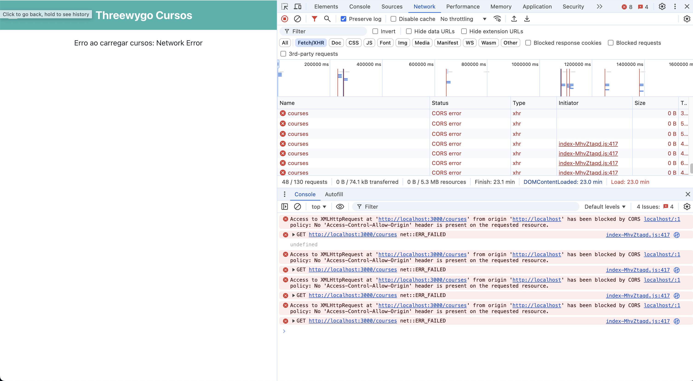

# Threewygo Cursos

## Visão Geral

Threewygo Cursos é uma aplicação web para gerenciamento e visualização de cursos online. Este README fornece informações sobre a configuração e um problema conhecido ao executar a aplicação usando Docker.

## Estrutura do Projeto

O projeto é dividido em duas partes principais:
- Frontend: Aplicação React
- Backend: API Rails

## Execução da Aplicação

### Método Manual (Recomendado)

A aplicação pode ser iniciada sem problemas seguindo estes passos:


1. Backend e Banco de dados:
   ```
   cd backend
   docker-compose up
   ```

2. Frontend:
   ```
   cd frontend
   npm install
   npm start
   ```

3. Acesso à Aplicação:
   Após iniciar o backend e o frontend, acesse a aplicação através do navegador:
   ```
   http://localhost:3001
   ```


### Usando Docker (Problema Conhecido)

Ao utilizar Docker para executar a aplicação, um problema de CORS (Cross-Origin Resource Sharing) é encontrado. Este problema não ocorre quando a aplicação é iniciada manualmente.

#### Detalhes do Problema de CORS no Docker

- O frontend, rodando em `http://localhost`, não consegue acessar o backend em `http://localhost:3000` devido a restrições de CORS.
- Mensagem de erro típica: "Access to XMLHttpRequest at 'http://localhost:3000/courses' from origin 'http://localhost' has been blocked by CORS policy."



## Informações Adicionais

- O problema de CORS é específico da configuração Docker e não afeta o funcionamento da aplicação quando iniciada manualmente.
